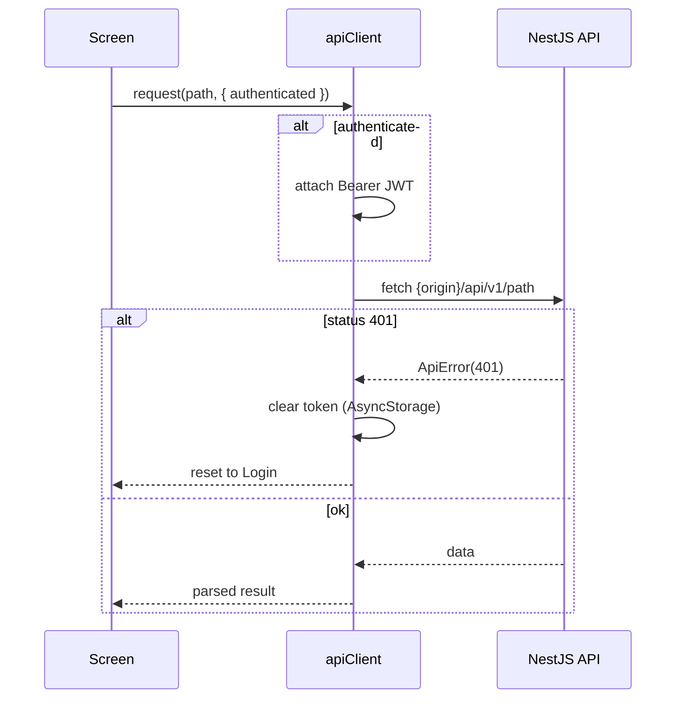
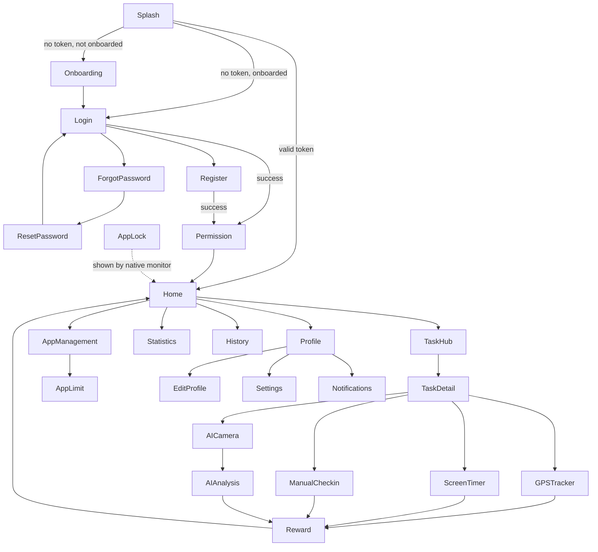

# Touch Grass Mobile (Frontend repo)
Backend repo is here: https://github.com/adin-67/BE_TouchGrass_Mobile

Android app for the **CSE430 course project "Touch Grass"**: blocks social-media apps until the
user completes real-world tasks (walking, photo verification, screen-off timers) and earns XP/Leaf
Points that unlock limited app access. This is the React Native client; the NestJS API lives in the
sibling `Backend` repo.

## Tech stack

- **React Native 0.86** + TypeScript (npm), **Android-only** — native modules in `src/native/` throw on iOS
- **React Navigation 7** (`native-stack`) with a deep link `touchgrass://reset-password`
- Native Android integration: usage stats, app control, accessibility monitor, ML Kit image labeling, vision-camera, geolocation
- **Google sign-in** (`@react-native-google-signin`) against the Touch Grass backend
- Jest + `@react-native/jest-preset` with native deps pre-mocked

## Prerequisites

- Node.js ≥ 22.11 (enforced by `engines`)
- Android SDK + an Android emulator or connected device (Java JDK for Gradle)
- A running backend: see `../Backend/README.md` (`.env`, MongoDB via Docker, `npm run seed:tasks`)
- The Google Web client ID in `src/config/oauth.ts` must match `GOOGLE_WEB_CLIENT_ID` in `Backend/.env`

## Setup & run

```bash
npm install
```

Start the backend first (`../Backend/`), then from `touchGrassMobile/`:

```bash
npm start           # start Metro (leave it running)
npm run android     # build & install on the emulator/device
```

> Note: `npm run android` spawns Metro only for the build/install step, then closes it — keep
> `npm start` running in a separate terminal (or restart Metro after) to stay connected.

### Connecting to the backend

- **Emulator (default):** `src/config/api.ts` points to `http://10.0.2.2:3000` — the emulator's
  alias for the host machine. No change needed.
- **Physical device:** change `DEFAULT_API_ORIGIN` in `src/config/api.ts` to your machine's LAN IP,
  e.g. `http://192.168.1.10:3000`.
- The API origin is overridable at runtime (stored in AsyncStorage) — see `src/storage/apiConfigStorage.ts`.

## Testing & checks

```bash
npm run lint        # ESLint (@react-native preset)
npm test            # Jest (__tests__/App.test.tsx)
npx tsc --noEmit    # typecheck — there is NO npm script for this; run it after changes
```

Jest mocks native deps (lucide icons, geolocation, ML Kit, vision-camera, async-storage) in
`jest.setup.js` + `jest.config.js`. When adding a native dependency, add its mock there or tests
will fail at import.

## Architecture

```
App.tsx
  SafeAreaProvider > AuthProvider > NavigationContainer (deep link touchgrass://reset-password) > AuthNavigator
```

- One native stack with `initialRouteName="Splash"`, `headerShown: false`. Screens and their route
  params are declared together in `src/navigation/` — keep `types.ts` in sync with
  `AuthNavigator.tsx`.
- `src/services/apiClient.ts` is the fetch wrapper: attaches the `Bearer` token, throws
  `ApiError(status, message)`, and on 401 clears the token and resets to Login. Use
  `authenticated: false` for public endpoints.
- Native Android bridges live in `src/native/` and throw off-Android.
- UI copy is Vietnamese; shared UI in `src/components/`, palette in `src/constants/colors.ts`.

### API request flow



## Screen flow

The 26 screens registered in `src/navigation/AuthNavigator.tsx` (all routes in one native stack,
`initialRouteName="Splash"`). `Splash` restores the session: no token → `Onboarding`/`Login`,
valid token → `Home`. `AppLock` is shown by the native accessibility monitor when a blocked app is
opened, rather than pushed from the stack:



## Project structure

```
src/
  App.tsx                  # entry: providers + navigation container
  navigation/              # AuthNavigator + route types (keep in sync)
  screens/                 # feature-grouped screens: auth, onboarding, home, tasks,
                           # verification, progress, rewards, apps, lock, profile
  services/                # apiClient, auth service, storage helpers
  native/                  # Android bridges (usage stats, app control, accessibility monitor)
  config/                  # api.ts (API origin), oauth.ts (Google client ID)
  constants/               # colors, theme
  storage/                 # AsyncStorage-backed runtime config
  components/              # shared UI
android/                   # native project (see build.gradle)
```
